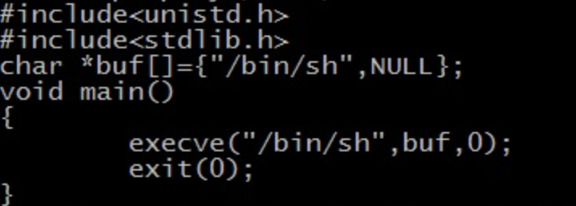
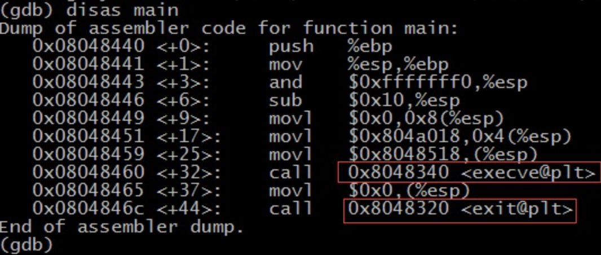
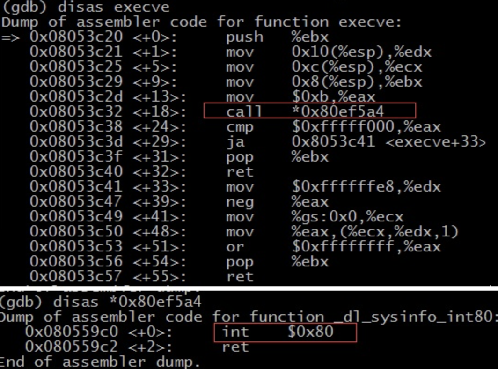

# shellcode

## 实验过程

Shellcode实际是一段代码（也可以是填充数据），是用来发送到服务器利用特定漏洞的代码，一般可以获取权限。另外，Shellcode一般是作为数据发送给受攻击服务的。 Shellcode是溢出程序和蠕虫病毒的核心，提到它自然就会和漏洞联想在一起，毕竟Shellcode只对没有打补丁的主机有用武之地。网络上数以万计带着漏洞顽强运行着的服务器给hacker和Vxer丰盛的晚餐。漏洞利用中最关键的是Shellcode的编写。由于漏洞发现者在漏洞发现之初并不会给出完整Shellcode，因此掌握Shellcode编写技术就显得尤为重要。 缓冲区溢出的shellcode很多了，这里重现下缓冲区溢出。

代码：

execve（执行文件）在父进程中fork一个子进程，在子进程中调用exec函数启动新的程序。execve()用来执行第一参数字符串所代表的文件路径，第二个参数是利用指针数组来传递给执行文件，并且需要以空指针(NULL)结束，最后一个参数则为传递给执行文件的新环境变量数组。从图中可以，如果通过C语言调用execve来返回shell的话，首先需要引入相应的头文件，然后在主函数中调用系统调用函数execve；同时传入三个参数。

为了能够之后能够看到反汇编的结果，采用的静态编译。正常返回shell。那么要想提取其中的shellcode就需要通过反汇编来获取相应的汇编代码或是二进制代码。如果要提取该程序中的获取shell的shellcode，就是要获取函数execve调用时参数及相应的系统调用。

retsh的反汇编结果：

execve函数反汇编后的结果：

从反汇编结果来看，execve函数执行的前一部分首先将向寄存器ebx,ecx,edx中赋值。之后调用了（*0x80ef5a4）处的代码，该处就是_dl_sysinfo_int80,反汇编后发现其实是通过中断指令int 0x80进入ring0。

也就是说exceve函数是通过调用软中断int 0x80进入ring0

